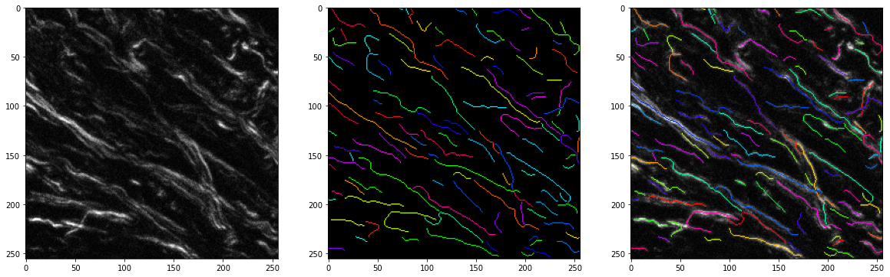

# Collagen fiber extraction and analysis in cancer tissue microenvironment  
This repository is part of the paper 

[**Collagen Fiber Centerline Tracking in Fibrotic Tissue via Deep Neural Networks with Variational Autoencoder-based Synthetic Training Data Generation**](https://www.sciencedirect.com/science/article/pii/S1361841523002219),\
Hyojoon Park*, Bin Li*, Yuming Liu, Michael S. Nelson, Helen M. Wilson, Eftychios Sifakis, Kevin W. Eliceiri, \
Medical Image Analysis 2023.

### Related repositories: 
* [DuoVAE](https://github.com/hjoonpark/DuoVAE)  

<div align="left">
  
</div>

* [Collagen fiber synthesis and extraction networks](https://github.com/hjoonpark/collagen-fiber-centerline-extraction)

<div align="left">
  
</div>

## Installation
**Install [anaconda/miniconda](https://docs.conda.io/en/latest/miniconda.html)**  
```
  $ conda env create --name collagen --file env.yml
  $ conda activate collagen
```
**If there are issues with OpenCV**  
```
  $ pip install opencv-contrib-python
```
**Install ridge-detection package**  
```
  $ pip install ridge-detection
```
**Install [PyTorch](https://pytorch.org/get-started/locally/)**  

## CenterLine class
This class handles the conversion between a centerline mask and a dictionary that contains the coordinates of individual centerlines, as well as the fiber property computation.   
For example, create a `CenterLine` object using a binary centerline mask:  
```python
    from centerline import CenterLine
    centerline = CenterLine(centerline_image=io.imread("examples/example_centerline.png"), associate_image=io.imread("examples/example_image.tif"))
```
`centerline_image` is a binary centerline mask, `associate_image` is an optional image of collagen fiber to which the binary mask corresponds.  
Compute the fiber properties:  
```python
    centerline.compute_fiber_feats() 
    print(dict(list(centerline.feats.items())[:-1]))
```
Create a colorized overlay of fiber centerline instances on the collagen fiber image:  
```python
    centerline_res.create_overlay()
```

<div align="center">
  
</div>

Other ways to create a `CenterLine` object, check notebook [centerline-basics.ipynb](centerline-basics.ipynb).   
### Read CT-FIRE results or use ridge detection
Check notebook [centerline-baselines.ipynb](centerline-baselines.ipynb)  

## FiberExtractor class
This class handles the computation of a fiber centerline mask from a neural network.  
Process a collagen fiber image:  
```python
    from fiber_extraction import FiberExtractor, UNet
    from skimage import io, img_as_uint
    net = UNet(1, 1, 16, True).eval()
    net.load_state_dict(torch.load('weights/netG.pt'))
    fiber_extractor = FiberExtractor(net)
    im_arr = img_as_uint(io.imread('examples/test_input.png'))
    result = fiber_extractor.compute(im_arr)
```
Compute the normalization range for 16-bit images. `file_list` is a list of directories to the image files.
```python
    fiber_extractor.normalization_range(file_list=file_list)
```
 This function computes the range in the 16-bit image set to be stretched to the range of `(0, 65535)`.  

## Citation

    @article{park2023collagen,
             title={Collagen fiber centerline tracking in fibrotic tissue via deep neural networks with variational autoencoder-based synthetic training data generation},
             author={Park, Hyojoon and Li, Bin and Liu, Yuming and Nelson, Michael S and Wilson, Helen M and Sifakis, Eftychios and Eliceiri, Kevin W},
             journal={Medical Image Analysis},
             volume={90},
             pages={102961},
             year={2023},
             publisher={Elsevier}
    }
