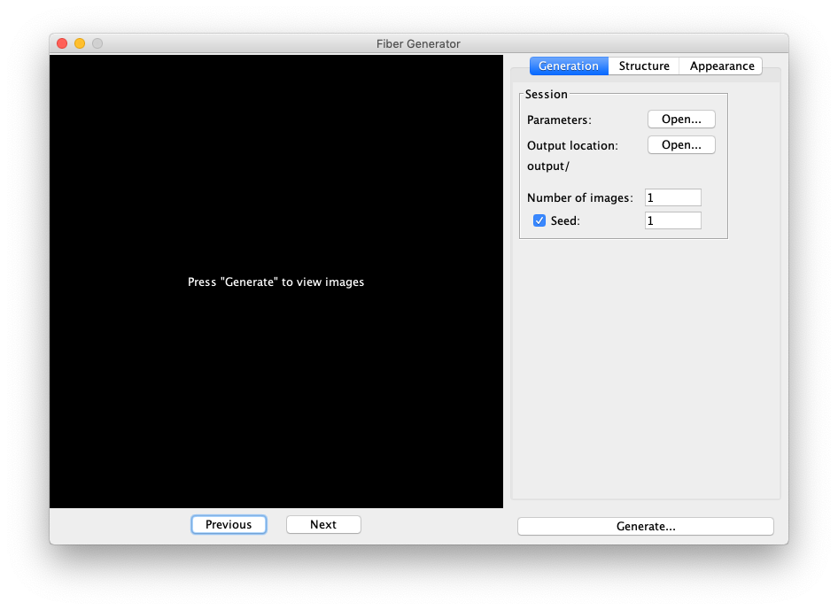
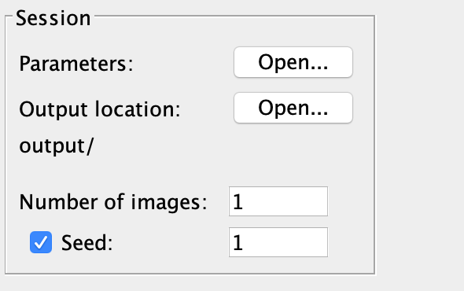
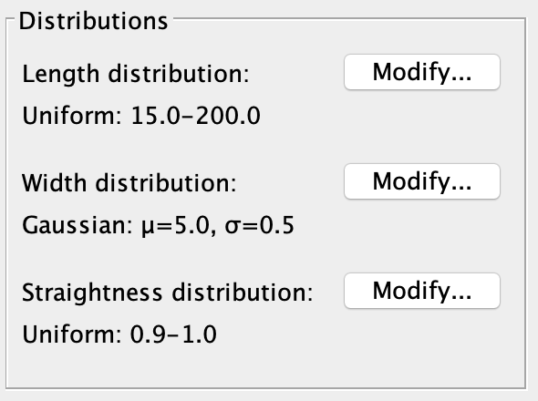
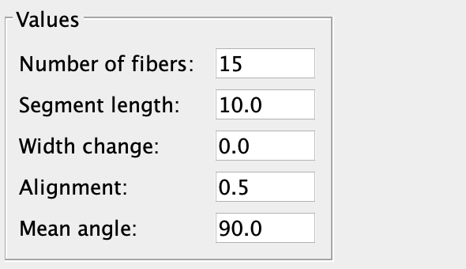
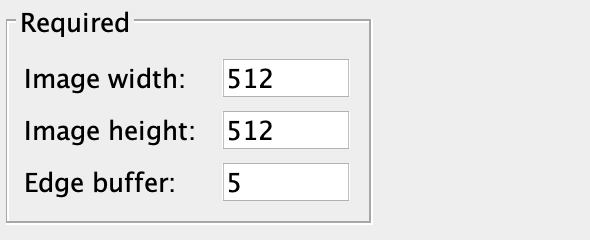
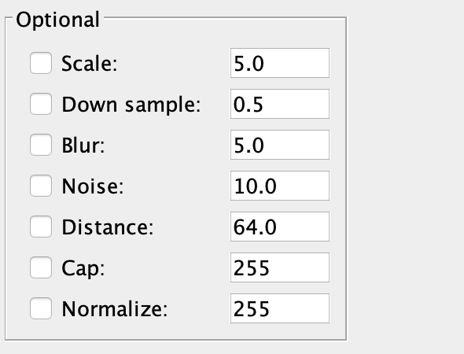
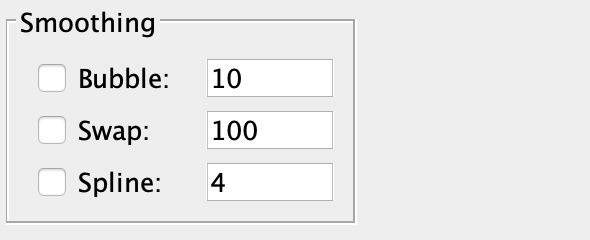

# Synthetic Fiber Generator - SynFiber

Affectionately known as “worm simulator.” Written by Matthew Dutson for the [Laboratory for Optical and Computational Instrumentation](https://loci.wisc.edu) (LOCI) at the University of Wisconsin-Madison.

## Objective

[CT-FIRE](https://loci.wisc.edu/software/ctfire) and [CurveAlign](https://loci.wisc.edu/software/curvealign) were developed by LOCI to analyze images of collagen fibers in human tissue. The alignment and orientation of these fibers can be a prognostic signature for certain cancers. SynFiber allows the user to generate synthetic images of collagen fibers with specific, known properties. These images can be used to verify the accuracy and test the limitations of CT-FIRE and CurveAlign.

More generally, SynFiber can be used to simulate images of any fibrous structure. It allows a great deal of customization of both the structure and appearance of fibers.

## Installation

SynFiber is distributed as ZIP archive - visit the [Releases](https://github.com/uw-loci/syntheticfibergenerator/releases) page for the most recent version. The extracted directory contains the following:

  - `syn_fiber.jar`: The main JRE executable
  - `defaults.json`: The default parameters file - this can be modified by the user
  - `output/`: The default output location

The JAR comes bundled with all dependencies, so the only prerequisite for running is an installation of the Java Runtime Environment (v1.8 or newer), which can be downloaded [here](http://www.java.com). SynFiber can be run simply by double-clicking `syn_fiber.jar` or from the command-line by navigating to the extracted directory and typing `java -jar syn_fiber.jar`

## Downloading the Source

The source is available from the Releases page or the project repository. It has two dependencies: Apache Commons Math and Google Gson. The test suite additionally requires JUnit 5. All three are available from Maven Central.

### Apache Commons Math

``` xml
<dependency>
   <groupId>com.google.code.gson</groupId>
   <artifactId>gson</artifactId>
   <version>2.8.5</version>
</dependency>
```

### Gson

``` xml
<dependency>
   <groupId>org.apache.commons</groupId>
   <artifactId>commons-math3</artifactId>
   <version>3.6.1</version>
</dependency>
```

### JUnit 5

``` xml
<dependency>
   <groupId>org.junit.jupiter</groupId>
   <artifactId>junit-jupiter-api</artifactId>
   <version>5.3.1</version>
</dependency>
```

## Basic Operation

### GUI Operation

On startup, the following window will display:



Provided SynFiber was launched in a valid working directory (one which contains `defaults.json` and `output/`) an image can be produced with default parameters by pressing the “Generate” button. A preview of the generated image will be displayed on the left side of the window.

To generate more than one image, modify the “Number of images” field and press the “Generate” button. The user can cycle through previews of multiple images by pressing the “Previous” and “Next” buttons.

While parameters can be manually modified through the GUI, it’s often more convenient to load a batch of parameters from a JSON file. This can be accomplished by pressing the “Open” button to the right of the “Parameters” label. Each time “Generate” is pressed, the current parameters are saved as `params.json` in the output directory. `params.json` has the same format as `defaults.json` and can be used to restore a previous session.

By default, image and data files are written to `output/` in the working directory. To change this location, press the “Open” button to the right of the “Output Location” label and select the desired directory.

### Command-Line Only Mode

The generator can be run in a non-interactive, command-line only mode by typing `java -jar syn_fiber.jar <param_file>`, where `<param_file>` is the path to a valid parameter JSON file. Results are sent to `output/`. If an exception occurs (an invalid parameter, nonexistent `output/` directory) an error message is printed and the program stops.

## Explanation of Options

### Session

  - Parameters: Used for bulk loading of parameters from a previous session (see “Basic Operation”).
  - Output location: Used to set the output directory - this defaults to `output/`.
  - Number of images: The number of random images to generate.
  - Seed: Whether to fix the random seed at the start of execution. If this is unchecked, a different set of images will be produced each time “Generate” is pressed. If checked, the sequence of random images will depend on the seed value.



### Distributions

  - Length distribution: A fiber’s length is defined as the sum of the lengths of its segments in pixels. Each fiber’s length is chosen by randomly sampling from the user-provided distribution.
  - Width distribution: The width in pixels of each fiber’s first segment is randomly sampled from this distribution. The evolution of the width after the first segment is governed by the “Width change” parameter.
  - Straightness distribution: Fiber straightness is defined as the ratio of the distance between a fiber’s endpoints to its length. Values must be in the range 0-1. After a fiber’s length is sampled, a straightness is sampled from this distribution and used to determine the distance between its endpoints.



### Values

  - Number of fibers: The number of fibers in each image.
  - Segment length: Each fiber is composed of linear segments. This parameter gives the length of each segment in pixels.
  - Width change: The maximum amount (in pixels) by which a fiber’s width can change between two adjacent segments. The actual change is sampled from a uniform distribution between `-widthChange` and `+widthChange`. If the current segment’s width is less than `widthChange`, then the sampling is instead from `-segment.width` to `+segment.width`.
  - Alignment: Let there be  fibers in an image with each having angle . The alignment of the image is given by:   
    
    ")  
  - Mean angle: Again let there be  fibers with angles . The mean angle of the image is given by:   
    
    ")  
     For two or more fibers it’s always possible to choose a set of fiber directions satisfying a given alignment and mean angle.



### Required

  - Image width: The width of the output images in pixels.
  - Image height: The height of the output images in pixels.
  - Edge buffer: The number of empty pixels to leave around the edge of the image. If a fiber doesn’t fit in the padded region then the buffer is set to zero for that fiber. The edge buffer only restricts the positions of endpoints. Fibers with low straightness may “wander” outside the padded region and end up near the edge of the image.



### Optional

  - Scale: Check to show a scale bar in the lower-left corner of the image. The parameter value gives the number of pixels per micron.
  - Down sample: Check to scale the image by the specified factor. A bilinear interpolation is used. Note that this option can be used to scale the image both down and up.
  - Blur: Check to apply a Gaussian blur to the image. The parameter value gives the height and width of the blurring kernel in pixels.
  - Noise: Check to add Poisson noise. The parameter value gives the Poisson mean. Each pixel has a brightness from 0 to 255. The value sampled from the Poisson distribution is added to this (capping the pixel brightness at 255). Therefore noise rates in the range 0-255 are typical.
  - Distance: Check to apply a distance filter. Let `falloff` be the parameter value. The intensity (0-255) of each pixel in the output image is equal to `falloff` times the distance to the nearest black background pixel.
  - Cap: Check to cap all intensities at a certain value (in the range 0 to 255). Let `cap` be the given value. Then the intensity of pixel `x, y` is updated as `intensity[x, y] = min(intensity[x, y], cap)`.
  - Normalize: Check to scale all intensities such that the maximum intensity is the given value (in the range 0 to 255). Let `max_a` be the actual maximum intensity and `max_d` be the desired maximum intensity. Then the intensity of pixel `x, y` is updated as `intensity[x, y] = intensity[x, y] * max_d / max_a`.



### Smoothing

  - Bubble: Runs a smoothing algorithm which sweeps over the fiber and swaps adjacent segments if doing so makes the fiber appear smoother. The parameter value gives the number of passes to make.
  - Swap: Runs a smoothing algorithm which swaps random pairs of segments if doing so makes the fiber appear smoother. The parameter value gives the average number of swaps attempted per segment.
  - Spline: Uses polynomial splines to interpolate extra points. The parameter value is roughly the ratio of the number of points after smoothing to the number of points before smoothing.



## Distribution Types

Pressing the “modify” button in the “Distributions” panel creates a dialog box which allows the user to modify the type and parameters of the distribution. All distributions have a lower and upper bound which cannot be modified and represent the range of valid values.

### Gaussian

Gaussian distributions have two parameters: “Mean” and “Sigma.” The only hard restriction is that sigma must be positive. It’s fine for the mean to be outside the range \[lower bound, upper bound\]; this just results in sampling exclusively from one side of the distribution and may be slower.

### Uniform

Uniform distributions have two parameters: “Minimum and”Maximum." The min must be less than the max, the min cannot exceed the upper bound, and the max cannot be less than the lower bound. This ensures that the range \[lower bound, upper bound\] has at least some overlap with \[minimum, maximum\]).

### Piecewise Linear

This represents an arbitrary, piecewise linear distribution. It has two compound parameters: “X values” and “Y values.” Each should be a comma-separated string of values. The x values must be in ascending order, and all y values must be positive. If the integral of the distribution is not one the y values are correctly scaled before sampling. All x values must be in the range \[lower bound, upper bound\]. The probability density is zero below the minimum and above the maximum x values in the list.
