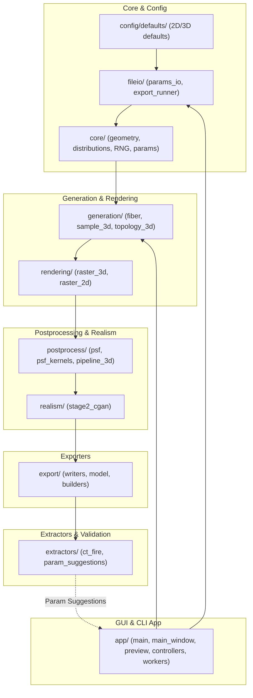

# Release Readiness Audit Report: 3D Synthetic Fiber Generator (3DSynFiberGen)

This document provides a thorough audit and technical review of the `3DSynFiberGen` codebase at [3DSynFiberGen](..). It identifies current limitations, critiques testing and documentation coverage, proposes architecture for formal release interfaces (headless CLI and PyQt6 GUI), and provides concrete code fixes for mathematical and performance bottlenecks.

---

## 1. Codebase Architecture Overview

The `3DSynFiberGen` codebase is structured modularly to handle parameter loading, fiber generation, volumetric rendering, physical microscopy modeling, GAN-based realism post-processing, and format-specific exports.



---

## 2. Test Suite Audit

### Current State
Running the test suite via the command line:
```bash
uv run python -m unittest discover -s tests -p "test_*.py" -v
```
results in:
```text
test_parallel_batch_smoke (smoke.test_batch_parallel.ParallelBatchSmokeTest) ... ok
test_export_package_smoke (smoke.test_export_package.ExportPackageSmokeTest) ... ok
test_generate_2d_smoke (smoke.test_generate_2d.Generate2DSmokeTest) ... ok
test_generate_3d_smoke (smoke.test_generate_3d.Generate3DSmokeTest) ... ok
test_params_roundtrip_smoke (smoke.test_params_roundtrip.ParamsRoundTripSmokeTest) ... ok
test_dialog_instantiates_with_uniform_distribution (unit.test_distribution_dialog.DistributionDialogTest) ... skipped 'Missing GUI dependency for dialog test: PyQt6'
test_embedded_viewer_methods_switch_stacks (unit.test_embedded_preview.EmbeddedPreviewRegressionTest) ... skipped 'Missing GUI dependency for embedded preview test: PyQt6'
test_scale_bar_spec_uses_pixels_per_micron (unit.test_scale_bar.ScaleBarSpecTest) ... ok
test_all_main_window_signal_targets_exist (unit.test_signal_bindings.SignalBindingRegressionTest) ... ok
test_suggest_params_from_canonical_sample (unit.test_param_suggestions.ParamSuggestionsTest) ... ok
test_radius_lookup_from_spatial_coordinates (unit.test_param_suggestions.RadiusLookupTest) ... ok

Ran 11 tests in 10.755s
OK (skipped=2)
```

### Critical Deficiencies
1. **No Core Algorithm Unit Testing**:
   * **Fourier Midpoint Displacement (FMD)** waviness scaling and endpoint-constrained polyline calculations (`geometry.py`) are not unit-tested.
   * **Richards–Wolf Vectorial PSF** numerical integration and Simpson rule approximations (`psf_kernels.py`) are untested.
   * **Sub-voxel Supersampling** rendering logic (`raster_3d.py`) lacks tests verifying mathematical voxel coverage.
   * **Topological Contact Graphs** extraction (`topology_3d.py`) lacks test verification.
2. **Brittle GUI Unit Tests**:
   * GUI tests directly import `PyQt6` and `napari` and are skipped if they are missing. In headless CI systems (like GitHub Actions), these tests will either skip or crash unless virtual display frames are configured.
3. **Tooling Inconsistency**:
   * The `pyproject.toml` file includes configuration blocks for `[tool.pytest.ini_options]`, but `pytest` is not declared as a development dependency. The current test suite relies strictly on standard `unittest`.

### Recent Test Improvements
* **Extraction Parameter Suggestions**: Level 1 and Level 2 tests were added (`test_param_suggestions.py`) to verify that `CanonicalSample` statistics correctly populate generator parameters, including spatial coordinate lookups for fiber radii.

### Actionable Testing Recommendations
* [ ] **Add Algorithmic Unit Tests**: Create unit tests targeting FMD straightness-to-polyline length iterations, vectorial PSF polarization angle results, and topological connectivity graphs.
* [ ] **Standardize on Pytest**: Add `pytest` and `pytest-qt` to `pyproject.toml` dev dependencies to simplify mocking, fixtures, and GUI event loops.
* [ ] **Headless CI Testing**: Integrate `pytest-xvfb` or set `os.environ["QT_QPA_PLATFORM"] = "offscreen"` globally in CI runner configurations to prevent GUI unit tests from blocking or failing.
* [ ] **Mock Heavy Computations**: Mock the stage 2 GAN `torch` model initialization and large convolve functions to keep tests running in under 2 seconds.

---

## 3. Documentation Audit

### Current State
* The main [README.MD](../README.MD) is almost empty, containing only the title: `Fiber Generator (2D/3D)`.
* There is no user guide, mathematical specification document, parameter dictionary, or developer setup guide.
* The only example code is [example_SHG_psf_image_simulation.py](./example_SHG_psf_image_simulation.py), which is a script demonstrating vectorial PSF simulation and Richardson-Lucy restoration.

### Actionable Documentation Recommendations
* [ ] **Expand README.MD**: Add sections for installation, CLI usage, GUI launch commands, and repository structure.
* [ ] **Parameter Configuration Guide**: Create a JSON parameter dictionary explaining what parameters represent (e.g. `straightness`, `alignment3D`, `NA`, `lambda_ex_um`, `fiberRadius`).
* [ ] **Mathematical Specification**: Document the underlying physics and math (e.g., Fourier Midpoint Displacement, Richards-Wolf Debye integrals, Simpson's rule integration limits).
* [ ] **API Reference**: Add docstring coverage and set up Sphinx or MkDocs to compile API documentation automatically.

---

## 4. Formal Release Requirements: Headless & GUI Interfaces

### Headless CLI Critique
The current entry point [main.py](../app/main.py) uses a basic command-line check:
```python
if len(args) > 1:
    # Load args[1] as config path and run generation
else:
    # Run PyQt6 GUI
```
* **Issues**:
  1. No proper command-line arguments parsing (`--help`, `-o/--output`, `--mode`, `--verbose`).
  2. Hardcoded output folder names (`output_3d` or `output_2d`) are written to the current working directory, which is inflexible.
  3. No structured stdout/stderr logging or progress tracking during headless batch processing.

### Proposed CLI Interface Design
Replace the manual argument checking with `argparse`:
```python
import argparse
import sys

def parse_args():
    parser = argparse.ArgumentParser(description="3D Synthetic Fiber Generator CLI")
    parser.add_argument("-c", "--config", type=str, help="Path to JSON configuration file.")
    parser.add_argument("-o", "--output", type=str, default="output", help="Output directory path.")
    parser.add_argument("--mode", choices=["2d", "3d"], help="Override config dimension mode.")
    parser.add_argument("--gui", action="store_true", help="Force launch GUI interface.")
    parser.add_argument("--headless", action="store_true", help="Force headless generation.")
    parser.add_argument("-v", "--verbose", action="store_true", help="Enable verbose log outputs.")
    return parser.parse_args()
```

### GUI Interface Critique & Isolation
The GUI is built using `PyQt6` and `napari`. It is feature-rich but couples GUI dependencies with core computational modules. 
* **Recommendation**: Ensure that GUI packages are completely optional. HPC servers running batch jobs should be able to run `pip install 3dsynfibergen[realism]` without installing heavy GUI modules like `napari` or `PyQt6` which depend on local X11 display servers.

### Packaging & Distribution
* [ ] **Console Scripts**: Register `3dsynfibergen` as an entry-point script in [pyproject.toml](../pyproject.toml):
  ```toml
  [project.scripts]
  3dsynfibergen = "app.main:main_entry"
  ```
* [ ] **Separate Dependencies**: Verify `gui` and `realism` optional dependency blocks in `pyproject.toml`.

---

## 5. Algorithmic Bugs & Performance Deficiencies

### A. Piecewise Linear Sampling Bug
* **Location**: [distributions.py:L250-268](../core/distributions.py#L250-L268)
* **Problem**: In piecewise linear sampling, the slope $m$ is computed. If the segment has a flat probability distribution ($y_1 = y_2$), the slope $m$ is $0$, meaning $a = 0.5 \cdot m = 0$. Dividing the roots by $2a$ results in division by zero, yielding `-inf` or `nan`.
* **Fix Proposal**:
  ```python
  # Check if quadratic term 'a' is near-zero (flat distribution segment)
  if abs(a) < 1e-12:
      # The equation reduces to a linear formulation: b * x + c = 0
      # Since m = 0: b = y1 and c = -y1 * x1 - cdf_remain
      # Therefore, y1 * (x - x1) = cdf_remain  =>  x = x1 + cdf_remain / y1
      if abs(y1) < 1e-12:
          raise ArithmeticError("Sampling failure (zero probability density)")
      return x1 + cdf_remain / y1
  
  discriminant = b ** 2 - 4 * a * c
  ```

### B. Volumetric Rasterization Memory Overhead
* **Location**: [raster_3d.py:L117-121](../rendering/raster_3d.py#L117-L121)
* **Problem**: Using `np.indices()` creates three dense 3D arrays of size $(Z, Y, X)$ representing every pixel coordinate. For large grids (e.g. $512 \times 512 \times 512$), this requires gigabytes of memory per segment calculation.
* **Fix Proposal**: Use 1D coordinate ranges and NumPy broadcasting to calculate distances on-the-fly without allocating full 3D index grids:
  ```python
  # Replace np.indices with broadcasted 1D coordinate ranges
  z_range = np.arange(min_z, max_z + 1, dtype=np.float32)
  y_range = np.arange(min_y, max_y + 1, dtype=np.float32)
  x_range = np.arange(min_x, max_x + 1, dtype=np.float32)

  z_coords = z_range[:, np.newaxis, np.newaxis]
  y_coords = y_range[np.newaxis, :, np.newaxis]
  x_coords = x_range[np.newaxis, np.newaxis, :]
  ```

### C. Quadratic Collision Checks
* **Location**: [topology_3d.py:L240-270](../generation/topology_3d.py#L240-L270)
* **Problem**: Finding contacts checks all segments of each fiber against all segments of all other fibers. This scales as $O(N^2 \cdot S^2)$, where $N$ is the fiber count and $S$ is segment count, which is extremely slow for large collections.
* **Fix Proposal**:
  Filter candidate segments by pre-calculating segment Axis-Aligned Bounding Boxes (AABB) and checking overlap before calling the expensive `segment_segment_distance_3d`:
  ```python
  # AABB overlap check
  left_min = np.minimum(left_start, left_end) - contact_radius
  left_max = np.maximum(left_start, left_end) + contact_radius
  right_min = np.minimum(right_start, right_end)
  right_max = np.maximum(right_start, right_end)

  if np.any(left_min > right_max) or np.any(right_min > left_max):
      continue # Bounding boxes do not overlap, skip segment distance check
  ```
  Alternatively, build a spatial grid or index segment midpoints in a `scipy.spatial.KDTree` to filter candidates.

---

## 6. Prioritized Release Roadmap

| Phase | Task | Details | Priority |
|---|---|---|---|
| **Phase 1** | Bug Fixes | Apply fixes for piecewise linear sampling, rasterization memory, and topology checks. | Critical |
| **Phase 2** | CLI & Entry Points | Implement `argparse` parser in `main.py` and register the `3dsynfibergen` console script in `pyproject.toml`. | High |
| **Phase 3** | Test Expansion | Implement unit tests for FMD path generation, PSF modeling, and add `pytest` runner dependencies. | High |
| **Phase 4** | Documentation | Write thorough `README.MD`, Parameter Guide, and configure automatic Sphinx/MkDocs build. | Medium |
| **Phase 5** | CI/CD Setup | Set up GitHub Actions for code linting (`ruff`), code formatting, and offscreen GUI testing. | Medium |

---

## 7. Action Plan: Steps to Release on GitHub

> **Scope**: Get `3DSynFiberGen` to a point where a researcher can install it from GitHub, run it headlessly or via GUI, and trust the output. Bugs confirmed by code inspection are marked **[confirmed]**; gaps are marked **[gap]**.

### Pre-conditions (do these first — they unblock everything else)

- [ ] **7.0 — Create a dedicated release branch** (`release/v1.0`) branched from `master` so that experimental work (e.g. `3Dfiber_validation`) does not block the release.
- [ ] **7.1 — Fix the confirmed piecewise-linear sampling div-by-zero** **[confirmed]** (`core/distributions.py:255`). When the slope `m = 0`, the quadratic coefficient `a = 0` and the `2*a` denominator is zero. Add the flat-segment guard proposed in §5A before discriminant computation. Add a regression unit test that samples from a uniform piecewise distribution where consecutive x-values are equal.

---

### Phase A — Bug Fixes (before any release tag)

- [ ] **A.1 — Piecewise-linear sampling guard** (see 7.1 above).
- [ ] **A.2 — Rasterization memory** **[confirmed]** (`rendering/raster_3d.py:117` and `:58`). Replace `np.indices()` with broadcasted 1D ranges as proposed in §5B. Validate against the existing `test_generate_3d_smoke` smoke test — output should be bit-identical for small grids.
- [ ] **A.3 — Topology AABB pre-filter** **[confirmed]** (`generation/topology_3d.py:240–269`). Add the bounding-box overlap check before calling `segment_segment_distance_3d`. Run the 3D smoke test to confirm contact graphs are unchanged.
- [ ] **A.4 — Regression tests for all three fixes** — at minimum one unit test per fix. These tests must pass in a headless `python -m pytest` run with no display.

---

### Phase B — Testing

Current state: 5 smoke tests + 6 unit tests, all `unittest`, no `pytest`, no CI.

- [ ] **B.1 — Add `pytest` and `pytest-qt` to `pyproject.toml`** dev dependencies. The `[tool.pytest.ini_options]` block already exists but `pytest` is not installed. Confirm `uv run pytest tests/` passes all 13 existing tests (11 pass, 2 skip on headless) before adding new ones.
- [ ] **B.2 — Algorithmic unit tests** (highest value, currently zero coverage):
  - `tests/unit/test_geometry.py` — FMD polyline: verify that `straightness=1.0` produces a straight line, `straightness=0.0` produces a path whose arc/chord ratio satisfies the spec, endpoint constraint is satisfied to within 1 px.
  - `tests/unit/test_psf_kernels.py` — Richards–Wolf PSF: verify that the intensity sum over the XY plane is conserved (energy conservation), and that the FWHM in XY matches the theoretical `λ/(2 NA)` to within 10%.
  - `tests/unit/test_distributions.py` — Piecewise linear: zero-slope segment, single-point distribution, large sample mean/variance matches spec.
  - `tests/unit/test_topology.py` — Two perfectly parallel fibers whose closest approach equals `contact_radius` are detected as contacts; two fibers further apart are not.
- [ ] **B.3 — Headless GUI test config** — add `conftest.py` at `tests/` root that sets `os.environ["QT_QPA_PLATFORM"] = "offscreen"` before any import so GUI unit tests run in CI without a display. Remove the `skipTest` guards or convert them to `pytest.importorskip`.
- [ ] **B.4 — Coverage gate** — add `pytest-cov` to dev deps; target ≥60% line coverage on `core/` and `generation/` before tagging v1.0.

---

### Phase C — Documentation

Current state: `README.MD` is a 2-line stub. No install guide, no parameter reference, no math spec.

- [ ] **C.1 — README.MD** (minimum viable; write before any public announcement):
  - Installation section: `pip install ".[gui]"` for GUI, `pip install ".[realism]"` for GAN post-processing, bare `pip install .` for headless.
  - Quick-start: one-liner CLI command with a bundled example JSON config, and how to launch the GUI.
  - Link to the parameter guide (C.2) and the audit document.
- [ ] **C.2 — Parameter reference** (`docs/parameters.md`): one row per parameter covering name, type, units, valid range, and default. Priority fields: `nFibers`, `length`, `width`, `straightness`, `meanAngle`, `alignment`, `imageWidth`, `imageHeight`, `fiberRadius`, `NA`, `lambda_ex_um`, `n_medium`, `z_step_um`.
- [ ] **C.3 — Math specification** (`docs/math_spec.md`): one section each for FMD polyline generation, Richards–Wolf Debye integrals, sub-voxel supersampling, and soft-IOU metric. Equations in LaTeX markdown (renders on GitHub).
- [ ] **C.4 — Developer setup guide** (`docs/dev_setup.md`): MSYS2 UCRT64 environment (Python 3.14, fiber_backend .pyd), ctfire_py path setup, venv creation via `setup_ucrt64_env.sh`, how to run tests.

---

### Phase D — Headless & GUI Distribution

Current state: CLI is a raw `sys.argv` check; no `[project.scripts]` entry point; GUI and core are coupled at import time.

- [ ] **D.1 — Argparse CLI** (`app/main.py`): replace the `len(sys.argv) > 1` branch with `argparse` using at minimum `-c/--config`, `-o/--output`, `--mode {2d,3d}`, `--headless`, `--verbose`. The existing logic (load params → detect is_3d → batch generate → export) maps cleanly; just add proper argument parsing and structured logging.
- [ ] **D.2 — Console script entry point** (`pyproject.toml`):
  ```toml
  [project.scripts]
  3dsynfibergen = "app.main:main"
  ```
  After `pip install .`, users can invoke `3dsynfibergen --config params.json`.
- [ ] **D.3 — Guard GUI imports behind `[gui]` extra** — audit all `import PyQt6`, `import napari`, `import matplotlib` at module top level. Any import in a non-GUI module path (`core/`, `generation/`, `rendering/`, `export/`) should be deferred to function scope or behind `TYPE_CHECKING`. Goal: `pip install .` (no extras) + `python -c "from generation.sample_2d import FiberImage"` must succeed without PyQt6 installed.
- [ ] **D.4 — Headless smoke test without GUI extras** — add a CI job that installs bare `pip install .` (no `[gui]`) and runs only the 5 smoke tests. This verifies the separation from D.3.
- [ ] **D.5 — Bundled example config** — add `examples/shg_2d_defaults.json` and `examples/shg_3d_defaults.json` (export the current default params). Reference them in README quickstart.

---

### Phase E — CI/CD (GitHub Actions)

- [ ] **E.1 — Lint workflow** (`.github/workflows/lint.yml`): `ruff check .` on every push and PR. Already have `ruff` in dev deps.
- [ ] **E.2 — Test workflow** (`.github/workflows/test.yml`): matrix on ubuntu-latest + windows-latest, Python 3.10 and 3.12. Steps: `pip install ".[gui]" pytest pytest-qt pytest-cov`, set `QT_QPA_PLATFORM=offscreen`, run `pytest tests/ --cov`.
- [ ] **E.3 — Headless-only workflow**: separate job, `pip install .` (no extras), run smoke tests only. Confirms distribution isolation from D.4.
- [ ] **E.4 — Release workflow** (`.github/workflows/release.yml`): triggered on `v*` tag push; runs full test matrix, then `python -m build` + `twine upload` (or GitHub Packages). Adds release notes from `CHANGELOG.md`.

---

### Phase F — Suggested Future Refactoring (post-v1.0)

These are architectural improvements that are not blocking for an initial release but should be tracked.

- [ ] **F.1 — Topology acceleration**: Replace the O(N²·S²) loop with a `scipy.spatial.KDTree` on segment midpoints. Pre-filter to candidate pairs within `2 × contact_radius`, then call `segment_segment_distance_3d` only on those. Expected 10–100× speedup for large fiber collections (N > 50).
- [ ] **F.2 — Raster 3D streaming**: For volumes larger than 256³, the current approach allocates a dense coordinate grid per segment. Replace with a tiled/chunked rendering strategy that processes the volume in Z-slabs, keeping peak memory bounded.
- [ ] **F.3 — Decouple `CanonicalSample` from extractor adapters**: Move `CanonicalSample`, `CanonicalFiber`, `CanonicalPoint` to a standalone `exchange/` package so the extractor adapters (CT-FIRE, Ridge Detection, SOAX) can be distributed and tested independently without pulling in the full generator.
- [ ] **F.4 — Pytest migration**: Convert all `unittest.TestCase` classes to plain `pytest` functions using fixtures. Enables parametrize, better reporting, and `pytest-xdist` parallelism.
- [ ] **F.5 — Type annotation pass**: `core/`, `generation/`, and `rendering/` modules have incomplete type annotations. A full pass enables `mypy --strict` in CI and improves IDE tooling.
- [ ] **F.6 — Deprecate `output_2d/` / `output_3d/` hardcoded paths**: make the output directory a CLI argument (done in D.1) and propagate it through `ExportRunner` so headless batch jobs can write to user-specified locations.

---

### Release Checklist Summary

| # | Item | Phase | Status |
|---|---|---|---|
| 1 | Div-by-zero bug fixed + regression test | A.1 | open |
| 2 | Raster memory fix | A.2 | open |
| 3 | Topology AABB guard | A.3 | open |
| 4 | pytest added to dev deps; all 13 tests pass | B.1 | open |
| 5 | Algorithmic unit tests (geometry, PSF, distributions, topology) | B.2 | open |
| 6 | Headless GUI offscreen config (`conftest.py`) | B.3 | open |
| 7 | README.MD with install + quickstart | C.1 | open |
| 8 | Parameter reference doc | C.2 | open |
| 9 | argparse CLI in `main.py` | D.1 | open |
| 10 | `[project.scripts]` entry point in `pyproject.toml` | D.2 | open |
| 11 | GUI imports guarded behind `[gui]` extra | D.3 | open |
| 12 | Headless smoke test (no `[gui]` install) | D.4 | open |
| 13 | Bundled example config JSONs | D.5 | open |
| 14 | GitHub Actions lint + test + release workflows | E.1–E.4 | open |
