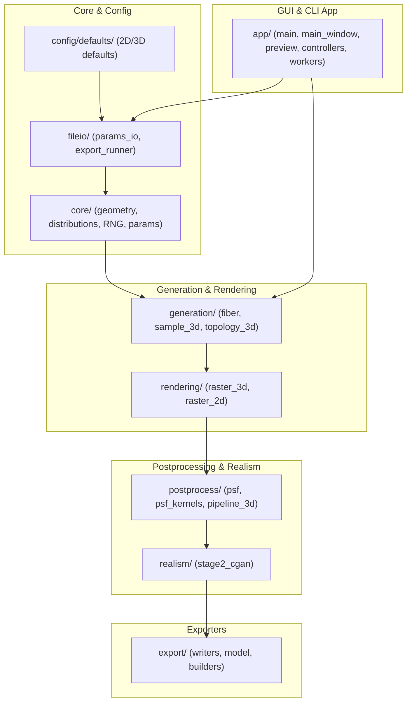

# Release Readiness Audit Report: 3D Synthetic Fiber Generator (3DSynFiberGen)

This document provides a thorough audit and technical review of the `3DSynFiberGen` codebase at [3DSynFiberGen](file:///Users/ympro/Documents/GitHub/curvelets/src/CurveAlign_CT-FIRE/3Dfibertracking/SyntheticFiberGen/3DSynFiberGen). It identifies current limitations, critiques testing and documentation coverage, proposes architecture for formal release interfaces (headless CLI and PyQt6 GUI), and provides concrete code fixes for mathematical and performance bottlenecks.

---

## 1. Codebase Architecture Overview

The `3DSynFiberGen` codebase is structured modularly to handle parameter loading, fiber generation, volumetric rendering, physical microscopy modeling, GAN-based realism post-processing, and format-specific exports.



---

## 2. Test Suite Audit

### Current State
Running the test suite via the command line:
```bash
uv run python -m unittest discover -s tests -p "test_*.py" -v
```
results in:
```text
test_parallel_batch_smoke (smoke.test_batch_parallel.ParallelBatchSmokeTest) ... ok
test_export_package_smoke (smoke.test_export_package.ExportPackageSmokeTest) ... ok
test_generate_2d_smoke (smoke.test_generate_2d.Generate2DSmokeTest) ... ok
test_generate_3d_smoke (smoke.test_generate_3d.Generate3DSmokeTest) ... ok
test_params_roundtrip_smoke (smoke.test_params_roundtrip.ParamsRoundTripSmokeTest) ... ok
test_dialog_instantiates_with_uniform_distribution (unit.test_distribution_dialog.DistributionDialogTest) ... skipped 'Missing GUI dependency for dialog test: PyQt6'
test_embedded_viewer_methods_switch_stacks (unit.test_embedded_preview.EmbeddedPreviewRegressionTest) ... skipped 'Missing GUI dependency for embedded preview test: PyQt6'
test_scale_bar_spec_uses_pixels_per_micron (unit.test_scale_bar.ScaleBarSpecTest) ... ok
test_all_main_window_signal_targets_exist (unit.test_signal_bindings.SignalBindingRegressionTest) ... ok

Ran 9 tests in 10.555s
OK (skipped=2)
```

### Critical Deficiencies
1. **No Core Algorithm Unit Testing**:
   * **Fourier Midpoint Displacement (FMD)** waviness scaling and endpoint-constrained polyline calculations (`geometry.py`) are not unit-tested.
   * **Richards–Wolf Vectorial PSF** numerical integration and Simpson rule approximations (`psf_kernels.py`) are untested.
   * **Sub-voxel Supersampling** rendering logic (`raster_3d.py`) lacks tests verifying mathematical voxel coverage.
   * **Topological Contact Graphs** extraction (`topology_3d.py`) lacks test verification.
2. **Brittle GUI Unit Tests**:
   * GUI tests directly import `PyQt6` and `napari` and are skipped if they are missing. In headless CI systems (like GitHub Actions), these tests will either skip or crash unless virtual display frames are configured.
3. **Tooling Inconsistency**:
   * The `pyproject.toml` file includes configuration blocks for `[tool.pytest.ini_options]`, but `pytest` is not declared as a development dependency. The current test suite relies strictly on standard `unittest`.

### Actionable Testing Recommendations
* [ ] **Add Algorithmic Unit Tests**: Create unit tests targeting FMD straightness-to-polyline length iterations, vectorial PSF polarization angle results, and topological connectivity graphs.
* [ ] **Standardize on Pytest**: Add `pytest` and `pytest-qt` to `pyproject.toml` dev dependencies to simplify mocking, fixtures, and GUI event loops.
* [ ] **Headless CI Testing**: Integrate `pytest-xvfb` or set `os.environ["QT_QPA_PLATFORM"] = "offscreen"` globally in CI runner configurations to prevent GUI unit tests from blocking or failing.
* [ ] **Mock Heavy Computations**: Mock the stage 2 GAN `torch` model initialization and large convolve functions to keep tests running in under 2 seconds.

---

## 3. Documentation Audit

### Current State
* The main [README.MD](file:///Users/ympro/Documents/GitHub/curvelets/src/CurveAlign_CT-FIRE/3Dfibertracking/SyntheticFiberGen/3DSynFiberGen/README.MD) is almost empty, containing only the title: `Fiber Generator (2D/3D)`.
* There is no user guide, mathematical specification document, parameter dictionary, or developer setup guide.
* The only example code is [example_SHG_psf_image_simulation.py](file:///Users/ympro/Documents/GitHub/curvelets/src/CurveAlign_CT-FIRE/3Dfibertracking/SyntheticFiberGen/3DSynFiberGen/docs/example_SHG_psf_image_simulation.py), which is a script demonstrating vectorial PSF simulation and Richardson-Lucy restoration.

### Actionable Documentation Recommendations
* [ ] **Expand README.MD**: Add sections for installation, CLI usage, GUI launch commands, and repository structure.
* [ ] **Parameter Configuration Guide**: Create a JSON parameter dictionary explaining what parameters represent (e.g. `straightness`, `alignment3D`, `NA`, `lambda_ex_um`, `fiberRadius`).
* [ ] **Mathematical Specification**: Document the underlying physics and math (e.g., Fourier Midpoint Displacement, Richards-Wolf Debye integrals, Simpson's rule integration limits).
* [ ] **API Reference**: Add docstring coverage and set up Sphinx or MkDocs to compile API documentation automatically.

---

## 4. Formal Release Requirements: Headless & GUI Interfaces

### Headless CLI Critique
The current entry point [main.py](file:///Users/ympro/Documents/GitHub/curvelets/src/CurveAlign_CT-FIRE/3Dfibertracking/SyntheticFiberGen/3DSynFiberGen/app/main.py) uses a basic command-line check:
```python
if len(args) > 1:
    # Load args[1] as config path and run generation
else:
    # Run PyQt6 GUI
```
* **Issues**:
  1. No proper command-line arguments parsing (`--help`, `-o/--output`, `--mode`, `--verbose`).
  2. Hardcoded output folder names (`output_3d` or `output_2d`) are written to the current working directory, which is inflexible.
  3. No structured stdout/stderr logging or progress tracking during headless batch processing.

### Proposed CLI Interface Design
Replace the manual argument checking with `argparse`:
```python
import argparse
import sys

def parse_args():
    parser = argparse.ArgumentParser(description="3D Synthetic Fiber Generator CLI")
    parser.add_argument("-c", "--config", type=str, help="Path to JSON configuration file.")
    parser.add_argument("-o", "--output", type=str, default="output", help="Output directory path.")
    parser.add_argument("--mode", choices=["2d", "3d"], help="Override config dimension mode.")
    parser.add_argument("--gui", action="store_true", help="Force launch GUI interface.")
    parser.add_argument("--headless", action="store_true", help="Force headless generation.")
    parser.add_argument("-v", "--verbose", action="store_true", help="Enable verbose log outputs.")
    return parser.parse_args()
```

### GUI Interface Critique & Isolation
The GUI is built using `PyQt6` and `napari`. It is feature-rich but couples GUI dependencies with core computational modules. 
* **Recommendation**: Ensure that GUI packages are completely optional. HPC servers running batch jobs should be able to run `pip install 3dsynfibergen[realism]` without installing heavy GUI modules like `napari` or `PyQt6` which depend on local X11 display servers.

### Packaging & Distribution
* [ ] **Console Scripts**: Register `3dsynfibergen` as an entry-point script in [pyproject.toml](file:///Users/ympro/Documents/GitHub/curvelets/src/CurveAlign_CT-FIRE/3Dfibertracking/SyntheticFiberGen/3DSynFiberGen/pyproject.toml):
  ```toml
  [project.scripts]
  3dsynfibergen = "app.main:main_entry"
  ```
* [ ] **Separate Dependencies**: Verify `gui` and `realism` optional dependency blocks in `pyproject.toml`.

---

## 5. Algorithmic Bugs & Performance Deficiencies

### A. Piecewise Linear Sampling Bug
* **Location**: [distributions.py:L250-268](file:///Users/ympro/Documents/GitHub/curvelets/src/CurveAlign_CT-FIRE/3Dfibertracking/SyntheticFiberGen/3DSynFiberGen/core/distributions.py#L250-L268)
* **Problem**: In piecewise linear sampling, the slope $m$ is computed. If the segment has a flat probability distribution ($y_1 = y_2$), the slope $m$ is $0$, meaning $a = 0.5 \cdot m = 0$. Dividing the roots by $2a$ results in division by zero, yielding `-inf` or `nan`.
* **Fix Proposal**:
  ```python
  # Check if quadratic term 'a' is near-zero (flat distribution segment)
  if abs(a) < 1e-12:
      # The equation reduces to a linear formulation: b * x + c = 0
      # Since m = 0: b = y1 and c = -y1 * x1 - cdf_remain
      # Therefore, y1 * (x - x1) = cdf_remain  =>  x = x1 + cdf_remain / y1
      if abs(y1) < 1e-12:
          raise ArithmeticError("Sampling failure (zero probability density)")
      return x1 + cdf_remain / y1
  
  discriminant = b ** 2 - 4 * a * c
  ```

### B. Volumetric Rasterization Memory Overhead
* **Location**: [raster_3d.py:L117-121](file:///Users/ympro/Documents/GitHub/curvelets/src/CurveAlign_CT-FIRE/3Dfibertracking/SyntheticFiberGen/3DSynFiberGen/rendering/raster_3d.py#L117-L121)
* **Problem**: Using `np.indices()` creates three dense 3D arrays of size $(Z, Y, X)$ representing every pixel coordinate. For large grids (e.g. $512 \times 512 \times 512$), this requires gigabytes of memory per segment calculation.
* **Fix Proposal**: Use 1D coordinate ranges and NumPy broadcasting to calculate distances on-the-fly without allocating full 3D index grids:
  ```python
  # Replace np.indices with broadcasted 1D coordinate ranges
  z_range = np.arange(min_z, max_z + 1, dtype=np.float32)
  y_range = np.arange(min_y, max_y + 1, dtype=np.float32)
  x_range = np.arange(min_x, max_x + 1, dtype=np.float32)

  z_coords = z_range[:, np.newaxis, np.newaxis]
  y_coords = y_range[np.newaxis, :, np.newaxis]
  x_coords = x_range[np.newaxis, np.newaxis, :]
  ```

### C. Quadratic Collision Checks
* **Location**: [topology_3d.py:L240-270](file:///Users/ympro/Documents/GitHub/curvelets/src/CurveAlign_CT-FIRE/3Dfibertracking/SyntheticFiberGen/3DSynFiberGen/generation/topology_3d.py#L240-L270)
* **Problem**: Finding contacts checks all segments of each fiber against all segments of all other fibers. This scales as $O(N^2 \cdot S^2)$, where $N$ is the fiber count and $S$ is segment count, which is extremely slow for large collections.
* **Fix Proposal**:
  Filter candidate segments by pre-calculating segment Axis-Aligned Bounding Boxes (AABB) and checking overlap before calling the expensive `segment_segment_distance_3d`:
  ```python
  # AABB overlap check
  left_min = np.minimum(left_start, left_end) - contact_radius
  left_max = np.maximum(left_start, left_end) + contact_radius
  right_min = np.minimum(right_start, right_end)
  right_max = np.maximum(right_start, right_end)

  if np.any(left_min > right_max) or np.any(right_min > left_max):
      continue # Bounding boxes do not overlap, skip segment distance check
  ```
  Alternatively, build a spatial grid or index segment midpoints in a `scipy.spatial.KDTree` to filter candidates.

---

## 6. Prioritized Release Roadmap

| Phase | Task | Details | Priority |
|---|---|---|---|
| **Phase 1** | Bug Fixes | Apply fixes for piecewise linear sampling, rasterization memory, and topology checks. | Critical |
| **Phase 2** | CLI & Entry Points | Implement `argparse` parser in `main.py` and register the `3dsynfibergen` console script in `pyproject.toml`. | High |
| **Phase 3** | Test Expansion | Implement unit tests for FMD path generation, PSF modeling, and add `pytest` runner dependencies. | High |
| **Phase 4** | Documentation | Write thorough `README.MD`, Parameter Guide, and configure automatic Sphinx/MkDocs build. | Medium |
| **Phase 5** | CI/CD Setup | Set up GitHub Actions for code linting (`ruff`), code formatting, and offscreen GUI testing. | Medium |
